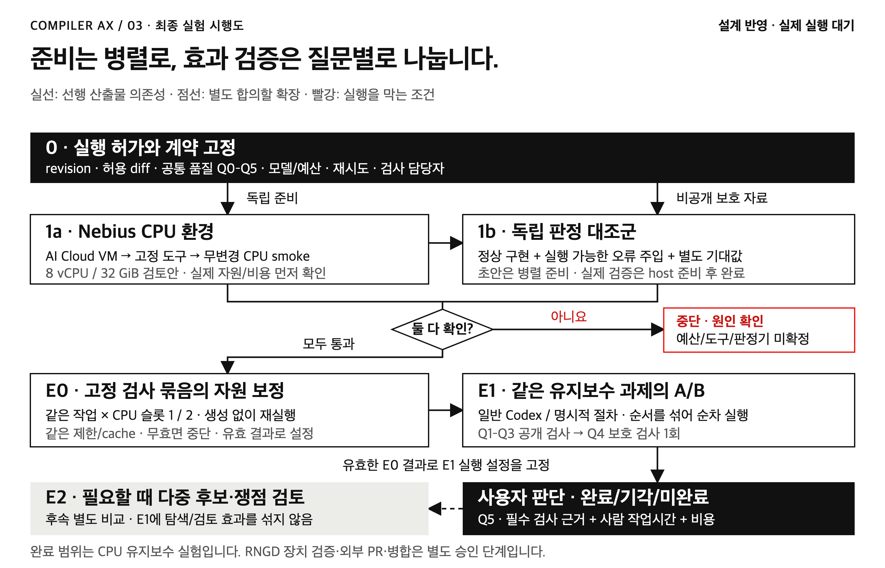

# Compiler AX Lab

프론티어 코딩 에이전트가 만든 변경을 컴파일러 개발자가 검토하고 유지할 수 있는 형태로 만드는 실험입니다. 생성량보다 **정확한 변경을 검토하는 데 든 사람 작업시간과 재작업**을 봅니다.

공개 `furiosa-opt`의 Rust 예제를 대상으로 실험을 설계했습니다. FuriosaAI와 무관한 개인 연구이며, 내부 컴파일러·CI·승인 체계를 재현한 프로젝트가 아닙니다. **현재는 설계·산술 검증 단계입니다. Rust 빌드, 클라우드 실험, NPU 측정은 아직 수행하지 않았습니다.**

## 먼저 읽을 것

1. [실험 계획](docs/experiment.md): E0 자원 보정, E1 업무 절차 비교, 별도 E2 확장.
2. [품질 계약](docs/quality.md): 기존 컨벤션, 검사별 보장 범위, Q0–Q5.
3. [시행도](report/assets/compiler-ax-experiment-approval.html): 로컬 브라우저로 열 수 있는 단일 HTML.
4. [PR·병합 절차](docs/merge.md): 검사한 revision, 사람 판단, 병합 후 확인.
5. [판단 컨텍스트](docs/context.md)와 [1차 출처](docs/sources.md): 채택 이유와 읽은 범위.



## 지금 재현할 수 있는 검사

Node.js 22 이상이면 추가 패키지 없이 실행합니다.

```bash
node scripts/check.mjs
```

이 명령은 문서 링크·공개 파일 경계·품질 단계·PR 필드 및 512개 산술 조합을 검사합니다. 컴파일러의 정확성이나 생산성 효과를 검사하는 명령은 아닙니다. GitHub Actions도 같은 명령을 PR과 `main`에서 실행합니다.

선택적 그림 재검수는 이미 설치된 Playwright와 Chromium을 사용합니다. 설치나 브라우저 다운로드를 자동 수행하지 않습니다.

```bash
PLAYWRIGHT_PACKAGE=/absolute/path/to/playwright/package.json \
CHROMIUM_EXECUTABLE=/absolute/path/to/chromium \
node report/render-experiment-approval.mjs
```

## 작업공간과 공개 범위

이 저장소는 **실험 설계·운영용**입니다. A/B 후보는 별도 clean checkout에서 동일한 공개 요구·도구를 받습니다. B에만 추가 절차를 제공하며, 이 저장소의 설계 컨텍스트 전체를 후보에게 주입하지 않습니다.

기존 개인 작업공간의 원고와 이력은 보존했습니다. 선택한 로컬 참고 자료는 Git에서 제외한 `.local/context/`에 있습니다. 원문 전사·논문 사본·지원 자료·계정 기록·보호 검사 입력·실제 실행 로그는 공개하지 않습니다. `.gitignore`는 접근 통제 수단이 아니므로 보호 검사는 후보와 별도 권한의 실행 환경에 둡니다.

공개 저장소 생성과 문서 게시가 실험 실행이나 Furiosa upstream PR 승인까지 의미하지는 않습니다. 비용·접근·예산·검토자와 보호 기준을 고정한 후 첫 CPU smoke를 승인받는 것이 다음 단계입니다.
